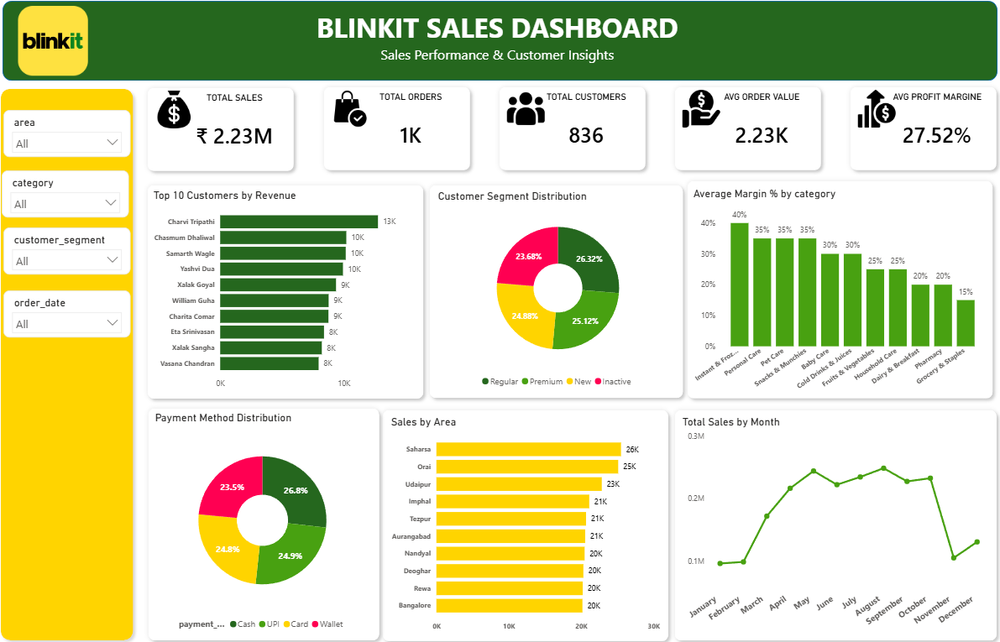

# 🛒 Blinkit Sales Analysis Dashboard

> End-to-End Business Intelligence Project using **MySQL, Excel, and Power BI**

---

## 📌 Project Overview

The **Blinkit Sales Analysis Dashboard** is an end-to-end Business Intelligence project developed to analyze retail sales data and generate actionable business insights.

The project demonstrates the complete analytics workflow—from SQL data preparation and Excel analysis to interactive dashboard creation in Power BI.

---

## 🎯 Objectives

- Analyze overall sales performance
- Identify top-performing sales areas
- Analyze customer purchasing behavior
- Evaluate product profitability
- Study monthly sales trends
- Understand customer payment preferences
- Build an interactive Power BI dashboard

---

# 📊 Dashboard Preview

> Replace the path below if your image is stored in a different folder.



---

# 📈 Dashboard KPIs

| KPI | Value |
|------|------:|
| 💰 Total Sales | ₹2.23M |
| 📦 Total Orders | 1,000 |
| 👥 Total Customers | 836 |
| 💵 Average Order Value | ₹2.23K |
| 📈 Average Profit Margin | 27.52% |

---

# 📊 Dashboard Features

### KPI Cards
- Total Sales
- Total Orders
- Total Customers
- Average Order Value
- Average Profit Margin

### Interactive Charts
- 📍 Sales by Area
- 👥 Top 10 Customers by Revenue
- 📈 Monthly Sales Trend
- 🥧 Customer Segment Distribution
- 💳 Payment Method Distribution
- 📊 Average Profit Margin by Category

### Interactive Filters
- Area
- Category
- Customer Segment
- Order Date

---

# 🗄️ SQL Analysis

The following SQL operations were performed:

- Database Creation
- Data Import
- Table Joins
- Sales Analysis
- Customer Analysis
- Monthly Sales Trend
- Profit Margin Analysis
- KPI Generation

---

# 📊 Excel Analysis

Performed using Microsoft Excel:

- Pivot Tables
- Sales Summary
- Customer Analysis
- Profit Analysis
- Monthly Trend Analysis

---

# 📈 Power BI Dashboard

The dashboard was developed using Power BI with:

- Interactive KPI Cards
- Dynamic Filters (Slicers)
- Business Charts
- Drill-down Analysis
- Professional Dashboard Design

---

# 💡 Key Business Insights

- Highest sales were generated from the top-performing sales areas.
- High-margin product categories contribute significantly to profitability.
- A small number of customers generate a large share of revenue.
- Customer segmentation helps identify valuable customer groups.
- Monthly sales trends reveal seasonal business patterns.
- Multiple payment methods improve customer convenience.

---

# 🛠️ Tools & Technologies

| Tool | Purpose |
|------|---------|
| MySQL Workbench | SQL Queries & Data Preparation |
| Microsoft Excel | Data Cleaning & Pivot Tables |
| Power BI | Dashboard Development |
| GitHub | Version Control & Project Hosting |

---

# 📂 Project Structure

```text
Blinkit-Sales-Analysis/
│
├── Dashboard/
│   └── Blinkit_Dashboard.png
│
├── SQL/
│   └── Blinkit_SQL_Analysis.sql
│
├── Excel/
│   └── Blinkit_Pivot_Analysis.xlsx
│
├── Dataset/
│   ├── customers.csv
│   ├── orders.csv
│   ├── order_items.csv
│   └── products.csv
│
├── Blinkit_Sales_Dashboard.pbix
├── Blinkit_Business_Performance_Report.docx
├── Blinkit_Sales_Dashboard_Portfolio_Report.pdf
└── README.md
```

---

# 🚀 Skills Demonstrated

- SQL
- MySQL
- Data Cleaning
- Data Analysis
- Data Visualization
- Microsoft Excel
- Pivot Tables
- Power BI
- Dashboard Design
- Business Intelligence
- Analytical Thinking

---

# 📷 Project Deliverables

- ✅ SQL Analysis
- ✅ Excel Pivot Analysis
- ✅ Power BI Dashboard
- ✅ Business Performance Report
- ✅ Portfolio PDF


Mechanical Engineering Student | Aspiring Data Analyst

